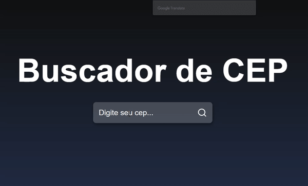
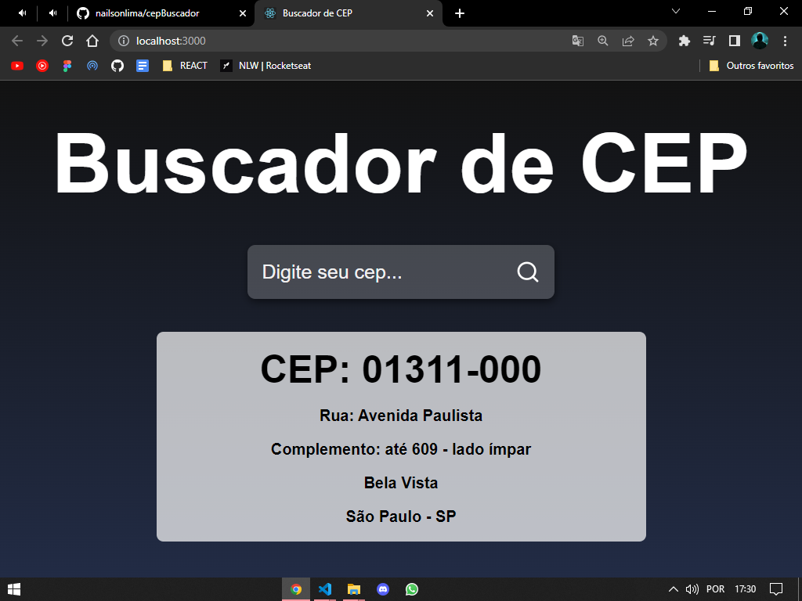

# BUSCADOR DE CEP

## 🔴Descrição

Projeto rápido, feito com React.js

Apesar de simples, foi prazeroso codar essa aplicação!😃

## 🔵MEDIA

Teste de funcionalidade! OK✔

Assim ficou uma captura de tela da nossa aplicação

